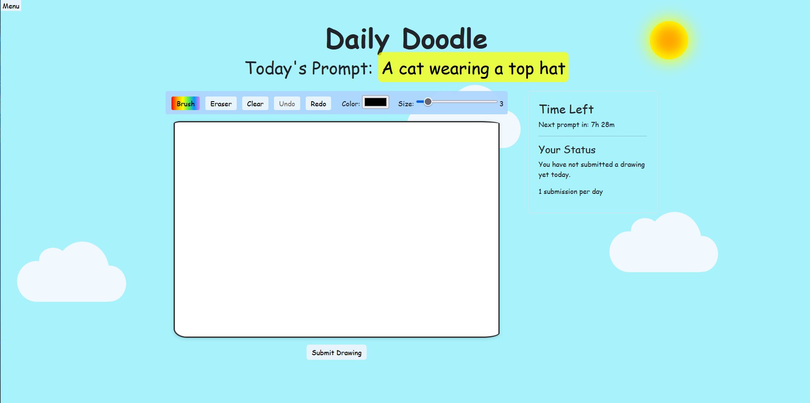
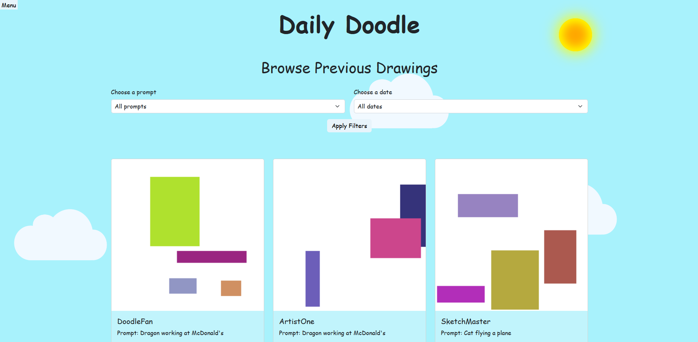
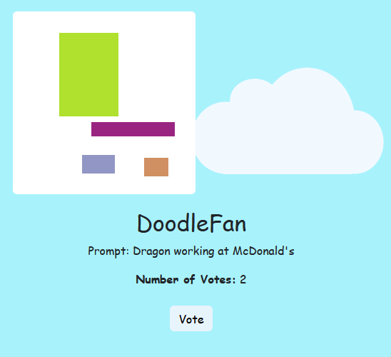
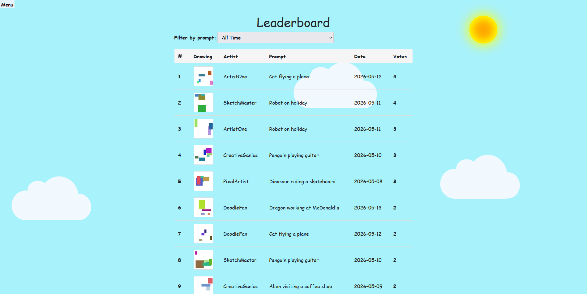

# Daily Doodle

CITS3403 Agile Web Development Project

## Overview

Daily Doodles is a web application where users receive a daily drawing prompt, create artwork using an in-browser drawing canvas, and submit their drawings for others to view and vote on.

Users can:
- Create an account and log in
- Receive a new daily drawing prompt
- Draw and submit artwork
- Browse drawings from other users
- Vote on their favourite submissions
- View the leaderboard to see the top-rated drawings of the day

---

## Features

### Drawing Canvas



### Filtered Browse Page



### Voting System



### All-Time / Prompt Leaderboard



---

## Technologies Used

### Backend
- Python
- Flask
- Flask-Login
- Flask-Migrate
- Flask-SQLAlchemy
- Flask-WTF
- SQLAlchemy

### Frontend
- HTML
- CSS
- Bootstrap
- JavaScript

### Testing
- unittest
- Selenium
- webdriver-manager

### Other
- python-dotenv

---
## Prerequisites

- Python 3.10+
- pip

## Installation

Clone the repository:

```bash
git clone https://github.com/hdavies159753/cits3403_app.git
cd cits3403_app
```
# Running the Application

## Windows

Run:
start.bat

## Mac/Linux

Run:
start.sh

These startup scripts automatically:
- create the virtual environment
- install requirements
- initialize the database

# Running Tests

After installation, run the application, open a terminal in the project folder and run:

## Unit Tests

python -m unittest discover tests

## Selenium Tests

python -m unittest discover tests/selenium

# Structure

app/                Main Flask application
tests/              Unit and Selenium tests
migrations/         Database migrations

# Authors

## CITS3403 Project Team
Aidan Harding, Alan Ling , Henry Davies, Oscar Chan